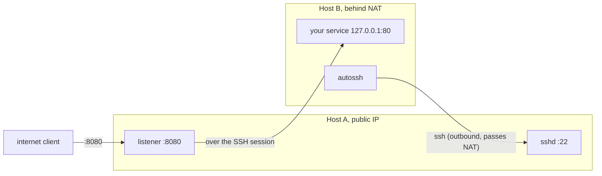

# reverse-ssh-tunnel

A minimal Alpine container running an OpenSSH server, used as the remote side of a
reverse SSH tunnel. It lets a machine behind NAT reach out (outbound connections are
universally allowed) and open a persistent tunnel, so a box with a public IP can expose
ports on the NAT'd machine without any inbound access to it.

## How it works



Host B initiates an outbound SSH session to Host A with a remote forward:

```
-R 0.0.0.0:8080:127.0.0.1:80
```

Every connection Host A receives on :8080 is forwarded back over the session to
localhost:80 on Host B. Because B opens the connection, no inbound rules or port
mappings are needed on B.

Host A's sshd is key-based only (root, public key from the `SSH_PUBLIC_KEY` environment
variable) and uses `GatewayPorts clientspecified` so the `0.0.0.0` bind is honoured
and the port is reachable from the internet.

## Host A

### docker run

```sh
docker build -t ssh-tunnel .
docker run -d --name ssh-tunnel \
    -p 22:22 \
    -p 8080:8080 \
    -v sshd-etc:/etc/ssh \
    -v "$PWD/sshd_config:/etc/ssh/sshd_config:ro" \
    -e SSH_PUBLIC_KEY="${SSH_PUBLIC_KEY}" \
    ssh-tunnel
```

`-v sshd-etc:/etc/ssh` persists the SSH host keys across container rebuilds, so Host B
does not need to re-trust a changed host key each time. `sshd_config` is bind-mounted
read-only so config changes take effect on `docker restart` without rebuilding.

Note: the named volume is seeded from the image only the first time it is created; to
regenerate the host keys, remove it with `docker volume rm sshd-etc` (then re-trust the
host key on Host B).

### docker compose

`examples/docker-compose.yml` is an equivalent setup. Provide the public key via the
`SSH_PUBLIC_KEY` environment variable at run time.

## Host B

`examples/reverse-tunnel.service` is a systemd unit that runs the tunnel under autossh and
keeps it alive. Copy it to `/etc/systemd/system/reverse-tunnel.service`, set `TARGET_IP`
to Host A's address, and place the private key at `/etc/ssh-tunnel/key`. 
Optionally, change the ssh port and listening ports.

First connect manually using the root user, e.g. `su root`, `ssh root@<host-a>`, and accept the host key. 
This adds it to `/root/.ssh/known_hosts` so the unattended service can start without being prompted.

Then enable the service:

```sh
systemctl daemon-reload
systemctl enable --now reverse-tunnel
```

Verify from the internet with:

```sh
curl -v http://<host-a-public-ip>:8080/
```
